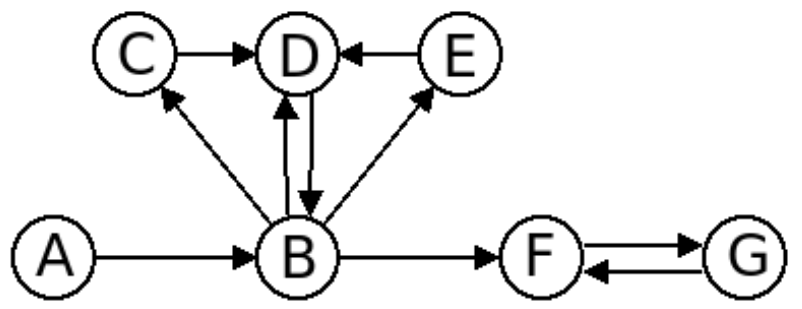
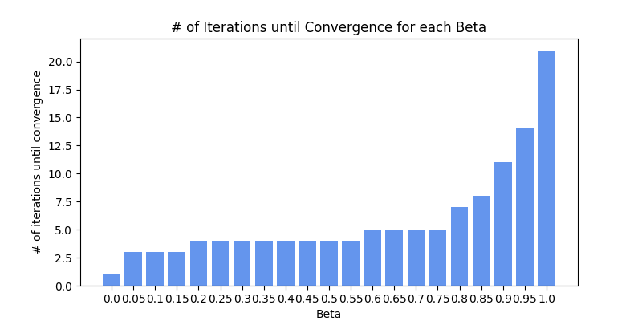
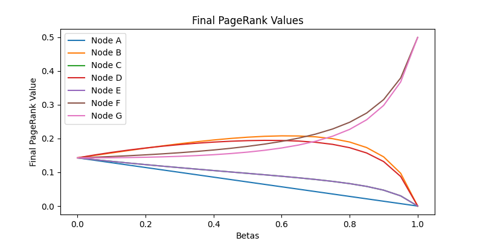

# Random Network Models
personal implementation of a Erdos-Renyi and a Barabasi-Albert model to generate a random graph

## Usage
To run both the Erdos-Renyi or the Barabasi-Albert model the script can just be run as it is.
```
python random_graphs.py
```
Running the script will overwrite the current results.  

In order to run only one of them, the other block of code has to be commented out from the main()-method.


# PageRank 
personal implementation of PageRank with power iteration and random teleportation

## Usage
To run both the PageRank on a predefined network with 7 nodes, just run the following command
```
python page_rank.py
```

Three additional parameter can be set via arguments.  
The amount of iterations (-i), the dampening factor / beta (-b)  
and a verbose (-v) mode to get informative prints on the command line.  
```
python page_rank.py -i 10 -b 0.73 -v
```

The predefined network looks like the following:



## Convergence Point of PageRank Values for Different Beta
A convergence criteria of 0.001 was used. If the PageRank value for a node does not change more than 0.001 for two iteration-steps the PageRank is considered to have converged at this iteration for this specific node. Then the maximum convergence value of all nodes is taken as a representative measure for the entire run with a specific beta.  


## Final PageRank Values over Different Betas
Development of the final PageRank values over different beta.  


